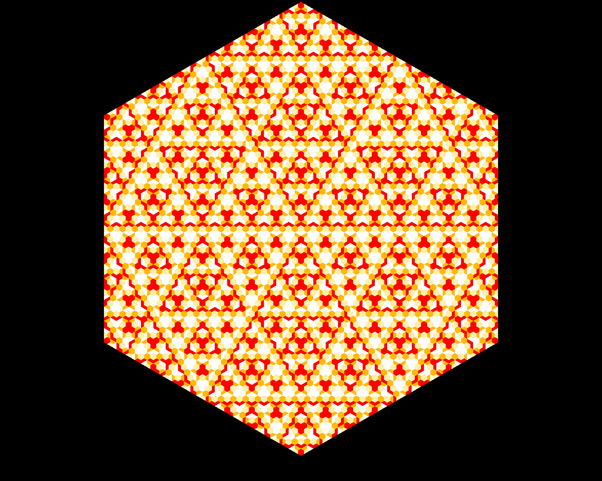
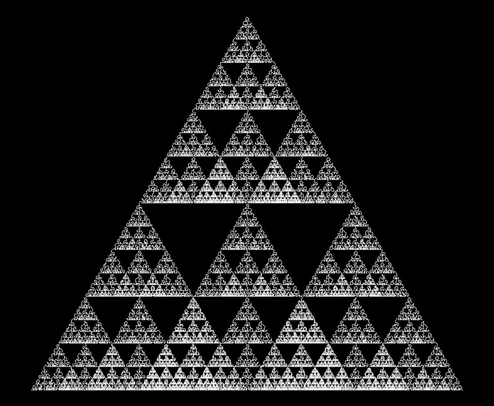
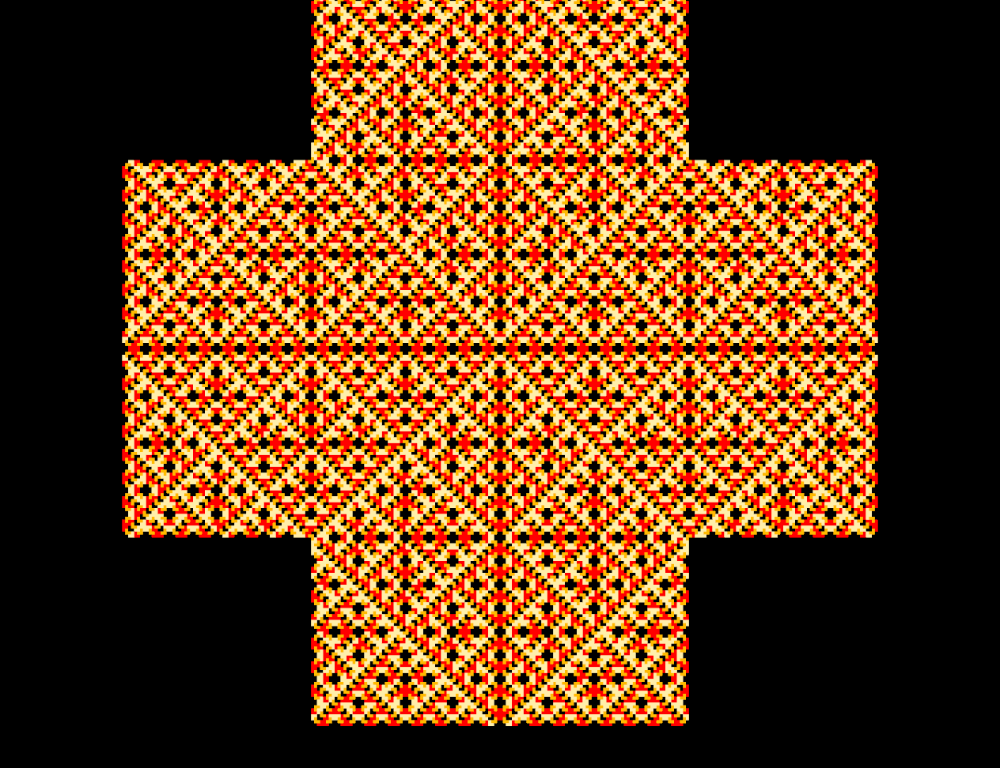
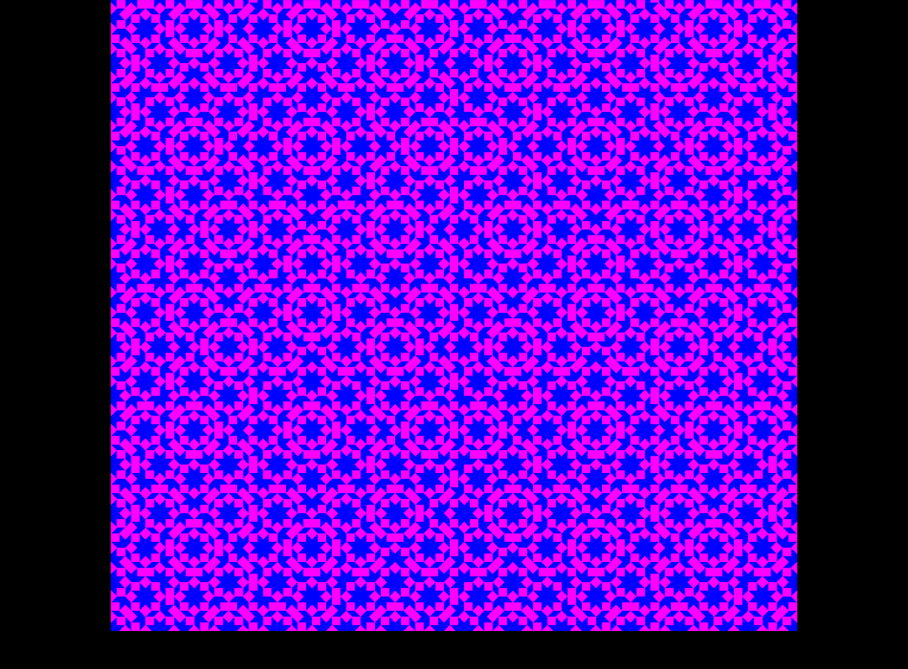
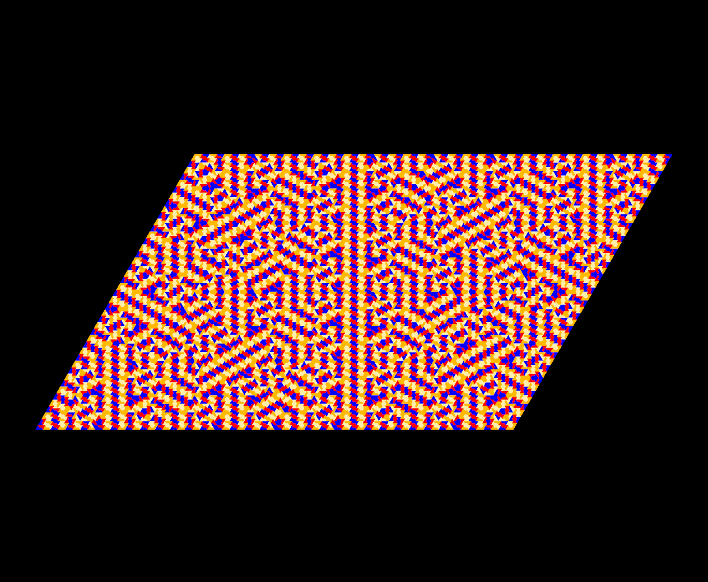

# Tilings

Below you will find a collection of fractal tilings I made using L-Systems and the [vlab](https://algorithmicbotany.org/virtual_laboratory/) programming environment. In L-Systems, given an initial string of tokens and a set of rules that describe how tokens can be replaced by other tokens, we can iterate a number of times to produce self-similar geometry such as fractals, plants, or natural patterns.

## Hexagon Tiling

<p align="center">
An arrangement of full and half hexagons with the right color choices reveals a Sierpinski-esque pattern.  
</p>

```c++
#include <lpfgall.h>

// Constant coodinates used for the initial shape
V2f p0(0, 1), p1(.866, .5), p2(.866, -.5), p3(0, -1), p4 (-.866, -.5), p5(-.866, .5); 

// Forward declarations of functions
module H(V2f, V2f, V2f, V2f);           // Half hex tile 
module A(V2f, V2f, V2f, V2f, V2f, V2f); // Full Hexagon

// Number of recursive steps
derivation length: 7; 

// The initial shape
Axiom: A(p0, p1, p2, p3, p4, p5);

// Function defintions
A(v1, v2, v3, v4, v5, v6) :
{
    produce H(v1, v2, v3, v4) H(v1, v6, v5, v4);
}

H(v1, v2, v3, v4) :
{
    V2f v14_1 = v1*.75 + v4*.25;
    V2f v14_2 = v1*.25 + v4*.75;
    V2f v12   = v14_1 + (v2 - v1) * .5;
    V2f v34   = v14_2 + (v3 - v4) * .5; 
    produce SetColor(3) H(v14_1, v12, v34, v14_2) 
            SetColor(4) H(v2, v12, v34, v3) 
            SetColor(5) H(v1, v14_1, v12, v2) 
            SetColor(7) H(v4, v14_2, v34, v3);
}

// Render instructions
interpretation:
H(v1, v2, v3, v4) :
{
    nproduce MoveTo2f(v1); // Move without drawing

    // SP - Start Polygon
    // PP - Vertex
    // EP - End Polygon
    produce SP
        PP MoveTo2f(v2)
        PP MoveTo2f(v3)
        PP MoveTo2f(v4) PP EP;
}

```
## Sierpinski Tetrahedron

<p align="center">
Using the turtle graphics drawing functionality of vlab, we can traverse a Sierpinski tetrahedron's vertices. Essentially turning it into a 1D function.  
</p>

```c++
#include <lpfgall.h>

V3f a(0,0,0), b(0.5, .866, -.3), c(1,0,0), d(0.5, 0, -.866); 

module T(V3f, V3f, V3f, V3f); // Tetrahedron

derivation length: 8; 

Axiom: T(a,b,c,d) ;

T(v1,v2,v3,v4) :
{
    V3f v12 = 0.5*(v1+v2) ;
    V3f v23 = 0.5*(v2+v3) ;
    V3f v13 = 0.5*(v1+v3) ;
    
    V3f v14 = 0.5*(v1+v4);
    V3f v24 = 0.5*(v2+v4);
    V3f v34 = 0.5*(v3+v4);

    produce T(v1,v13,v14,v12) T(v12,v2,v24,v23) T(v23, v13, v3, v34) T(v34,v24,v14,v4);
    
}

interpretation:

T(v1,v2,v3,v4) :
{
    produce LineTo3f(v4);
}
```
## Cross Tiling

<p align="center">
By coloring one of the cross sub-tiles black, this tiling attains a knitted appearance.  
</p>

```c++
#include <lpfgall.h>

V2f p0(-1, .5), p1(-.5, .5), p2(-.5, 1), p3(.5, 1), p4(.5,.5), p5(1,.5), p6(1,-.5), p7(.5,-.5), p8(.5,-1), p9(-.5,-1), p10(-.5,-.5), p11(-1,-.5);

module C(V2f, V2f, V2f, V2f, V2f, V2f, V2f, V2f, V2f, V2f, V2f, V2f); // Cross shaped prototile
module L(V2f, V2f, V2f, V2f, V2f, V2f);                               // L shaped tile

derivation length: 7; 

Axiom: C(p0, p1, p2, p3, p4, p5, p6, p7, p8, p9, p10, p11);

C(v1, v2, v3, v4, v5, v6, v7, v8, v9, v10, v11, v12) :
{
    V2f v0 = V2f(0,0);
    
    V2f v121 = (v1 + v12) * .5;
    V2f v34 = (v3 + v4) *.5;
    V2f v67 = (v6 + v7) *.5;
    V2f v910 = (v9 + v10) *.5;
        
    produce SetColor(3) L(v121, v1, v2, v3, v34, v0) 
            SetColor(4) L(v67, v6, v5, v4, v34, v0) 
            SetColor(5) L(v67, v7, v8, v9, v910 ,v0) 
            SetColor(6) L(v121, v12, v11, v10, v910, v0);
}

L(v1, v2, v3, v4, v5, v6) :
{
    V2f v23   = (v2 + v3) *.5;
    V2f v34   = (v3 + v4) *.5;
    V2f v56   = (v5 + v6) *.5;
    V2f v61   = (v6 + v1) *.5;
    V2f v563  = (v56 + v3) *.5;
    V2f v613  = (v61 + v3) *.5;
    V2f up    = v613 - v61;
    V2f right = v563 - v56;
    V2f vMid1 = v23 - up;
    V2f vMid2 = v34 - right;
    V2f vMid3 = v61 + up - right;

    produce SetColor(3) L(v56, v563, vMid2, v34, v4, v5) 
            SetColor(4) L(vMid1, v23, v3, v34, vMid2, vMid3) 
            SetColor(5) L(v61, v613, vMid1, v23, v2, v1)
            SetColor(6) L(v61, v613, vMid3, v563, v56, v6); 
}

interpretation:
C(v1, v2, v3, v4, v5, v6, v7, v8, v9, v10, v11, v12) :
{
    //Draw the centre 
    nproduce MoveTo2f(v2);
    nproduce SP
        PP MoveTo2f(v5)
        PP MoveTo2f(v8)
        PP MoveTo2f(v11) PP EP;

    //Draw the four outer portions
    nproduce MoveTo2f(v2);
    nproduce SP 
        PP MoveTo2f(v3) 
        PP MoveTo2f(v4) 
        PP MoveTo2f(v5) PP EP; 

    nproduce SP
        PP MoveTo2f(v6) 
        PP MoveTo2f(v7) 
        PP MoveTo2f(v8) PP EP;

    nproduce SP 
        PP MoveTo2f(v9) 
        PP MoveTo2f(v10) 
        PP MoveTo2f(v11) PP EP;

    produce SP
        PP MoveTo2f(v12) 
        PP MoveTo2f(v1)
        PP MoveTo2f(v2) PP EP;
}

L(v1, v2, v3, v4, v5, v6) : 
{
    nproduce MoveTo2f(v6);
    produce SP PP MoveTo2f(v1) PP MoveTo2f(v2) PP MoveTo2f(v3) PP MoveTo2f(v4) PP MoveTo2f(v5) PP EP;
}

```
## Aperiodic Tiling

<p align="center">
Comprised of squares, rhombuses, and triangles - interesting stars patterns emerge in this tiling.  
</p>

```c++
#include <lpfgall.h>

V2f a(0, 0), b(0, 1), c(1, 1), d(1, 0);

module S(V2f, V2f, V2f, V2f); // Square  (prototile)
module R(V2f, V2f, V2f, V2f); // Rhombus  (prototile)
module T(V2f, V2f, V2f);      // Triangle

derivation length: 5; 

Axiom: T(a, b, c) T(a, d, c);

/*******************

    SQUARE / TRIANGLE
    v2 ___ v3
      |  /|
      | / |
      |/__|
    v1     v4

    RHOMBUS    
     v2_______v3
      /      /
   v1/______/v4
         

********************/   

S(v1, v2, v3, v4) :
{
    produce T(v1, v2, v3) T(v1, v4, v3); 
}

T(v1, v2, v3) :
{
    V2f v12   = (v1*.4142)+(v2*.5858);
    V2f v13_1 = (v1*.7071)+(v3*.2929);
    V2f v13_2 = (v1*.2929)+(v3*.7071);
    V2f v23   = (v2*.4142)+(v3*.5858);
    V2f v123  = ((v1+v3)*.5)*.5858 + v2*.4142; 
    produce 
        SetColor(5) T(v12, v13_1, v1) 
        SetColor(2) R(v13_1, v12, v2, v123) 
        SetColor(5) T(v23, v123, v2) 
        SetColor(2) R(v3, v13_2, v123, v23) 
        SetColor(5) T(v13_2, v123, v13_1);      
}

R(v1, v2, v3, v4) : 
{
    V2f v12 = (v1*.5858)+(v2*.4142);
    V2f v23 = (v2*.4142)+(v3*.5858);
    V2f v34 = (v3*.5858)+(v4*.4142);
    V2f v41 = (v4*.4142)+(v1*.5858);
    V2f parallel = v41 - v1;
    V2f va  = v12 + parallel;
    V2f vb  = v34 - parallel;

    produce 
        SetColor(2) R(v1, v12, va, v41)
        SetColor(5) T(v12, va, v2) 
        SetColor(2) R(v2, vb, v4, va) 
        SetColor(5) T(v23, vb, v2) 
        SetColor(2) R(v3, v34, vb, v23) 
        SetColor(5) T(v34, vb, v4) 
        SetColor(5) T(v41, va, v4);
}

interpretation:

S(v1,v2,v3,v4) :
{
    nproduce MoveTo2f(v1);
    produce SP PP MoveTo2f(v2) PP MoveTo2f(v3) PP MoveTo2f(v4) PP EP;
}

T(v1, v2, v3) :
{
    nproduce MoveTo2f(v1);
    produce SP PP MoveTo2f(v2) PP MoveTo2f(v3) PP EP;
}

R(v1, v2, v3, v4) : 
{
    nproduce MoveTo2f(v1);
    produce SP PP MoveTo2f(v2) PP MoveTo2f(v3) PP MoveTo2f(v4) PP EP;
}

```
## Sphinx Tiling

<p align="center">
Unfortunately, I did not notice this one had a very obvious bug until recently. Much like how the real Sphinx has a missing nose, my rendition has a missing head.  
</p>

```c++
V2f p0(0, 0), p1(1, 1.7321), p2(1.5, .866), p3(2.5, .866), p4 (3, 0), p5(4, 1.7321);

module I(V2f, V2f, V2f, V2f, V2f); // Initial module
module S(V2f, V2f, V2f, V2f, V2f); // Sphinx tile

derivation length: 7; 

Axiom: I(p0, p1, p2, p3, p4) I(p5, p4, p3, p2, p1);

I(v1, v2, v3, v4, v5) :
{
    produce S(v1, v2, v3, v4, v5);
}

S(v1, v2, v3, v4, v5) :
{
    V2f d     = (v1+v5)*.5;
    V2f v0    = (v2 - v1)*.25;
    V2f a     = d + (v4-v5);
    V2f right = v3 - a;
    V2f b     = a - v0;
    V2f c     = b - right;
    V2f e     = d + v0;
    V2f h     = e + right;

    produce 
    SetColor(2) S(v5, v4, h, e, d)
    SetColor(3) S(v2, v3, a, b, c)
    SetColor(4) S(d, a, b, c, v1)
    SetColor(5) S(a, d, e, h, v4);
}

interpretation:
S(v1, v2, v3, v4, v5) :
{
    nproduce MoveTo2f(v1);
    produce SP
        PP MoveTo2f(v2)
        PP MoveTo2f(v3)
        PP MoveTo2f(v4) 
        PP MoveTo2f(v5) PP EP;
}
```
